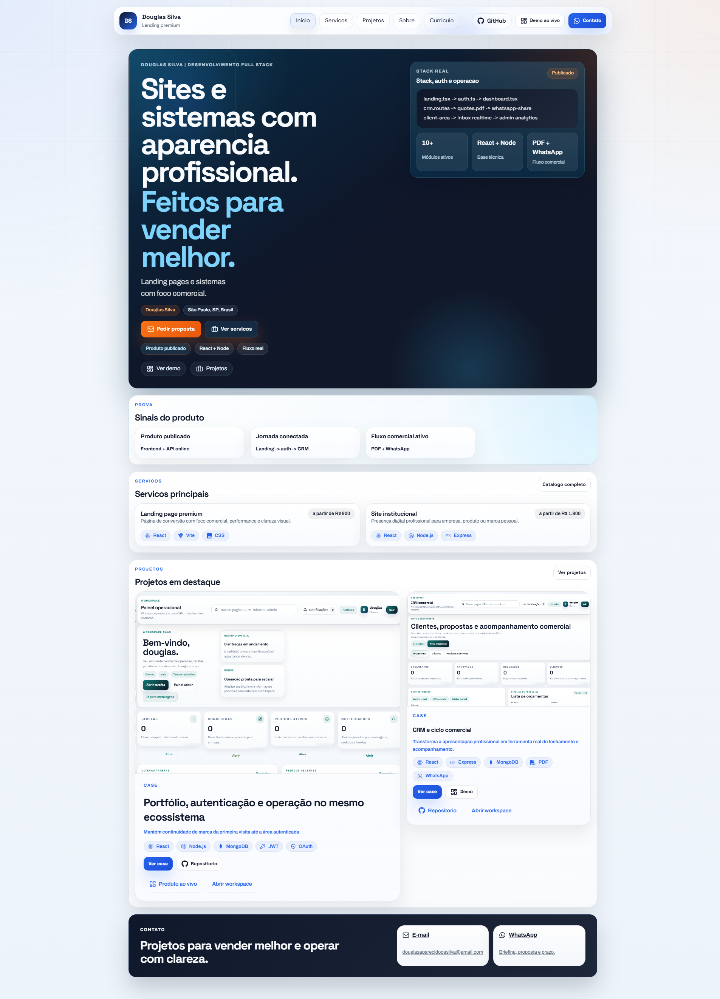

# Douglas Silva | Portfolio & Engineering Showcase

Esta é a camada pública de uma plataforma full-stack integrada, projetada para servir como portfólio profissional e demonstração de engenharia. O projeto conecta uma landing page comercial a um ecossistema autenticado (SaaS Demo), demonstrando competência em todo o ciclo de vida do software.



## 🚀 Visão Geral do Produto

O sistema foi arquitetado para demonstrar:
- **Navegação Híbrida:** Landing pages otimizadas para conversão e áreas protegidas por autenticação.
- **Arquitetura Full-Stack:** Integração fluida entre frontend (React), backend (Node.js) e persistência (MongoDB).
- **Prova de Conceito (PoC):** Módulos de CRM, Dashboard e Gestão de Clientes que operam como vitrines técnicas.

## 🛠️ Stack Tecnológica

- **Frontend:** React 19, Vite, React Router, Tailwind/CSS System.
- **Backend:** Node.js, Express, JWT (Autenticação), APIs REST.
- **Infraestrutura:** Deploy automatizado via Vercel e Render.

## 📂 Estrutura de Páginas

- `Portfolio.jsx`: Home comercial com foco em proposta de valor.
- `Services.jsx`: Catálogo de serviços técnicos e consultoria.
- `Curriculo.jsx`: Currículo online otimizado para sistemas ATS.
- `Projects.jsx`: Vitrine de projetos com estudos de caso detalhados.

## ⚙️ Desenvolvimento

```bash
# Instalar dependências
npm install

# Rodar em modo de desenvolvimento
npm run dev

# Build para produção
npm run build
```

## 📝 Observações Técnicas

- As rotas de `/dashboard`, `/admin` e `/login` redirecionam automaticamente para a **SaaS Auth Demo**, garantindo uma experiência de usuário contínua.
- O projeto utiliza um sistema de dados centralizado em `src/data/portfolioContent.js` para facilitar a manutenção e escalabilidade.

